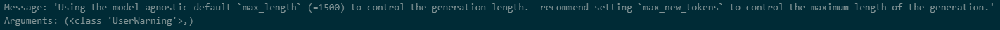
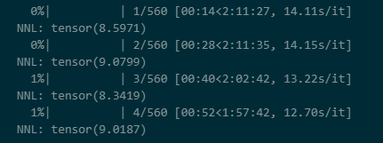

# ReadMe

### Guidance of Creating the Conda Environment

~~~powershell
conda craete -n env python=3.9
conda activate env

pip install torch==2.0.0
pip install -U audiocraft
~~~

### Code Description

There are two importable python methods named "MusicGen_Perplexity()" and "generate()" in the file `my_modules.py`. 

- "MusicGen_Perplexity()": calculate the perplexity of a music audio by interfacing MusicGen. Specifically, it predicts an audio segment on condition that the left part of the audio exists, with the conditional input shifted right.
- "generate()": predict the next half of music audio according to the first half part. NOTICE: MusicGen only supports to generate audios shorter than 30 seconds, therefore the generated contents may be shorter than the first half part.

### How to Run the Code

First, make sure you have an audio example, which can be mp3/wav files.

~~~powershell
# Generate
python my_modules.py --method generate --text EDM --audio test.mp3
# Evaluate(PPL)
python my_modules.py --method evaluate --audio test.mp3
~~~

See more details using the command below:

 `python my_modules.py -h`

### Result

#### 1 my_modules.generate()

- out_1: 

	- 参数：
		- model = musicgen-small
		- text prompt="Energetic EDM"
		- 不指定max_new_tokens，采用默认的max_length=1500

- out_2: 

	- 参数：
		- model = musicgen-small
		- text prompt="Energetic EDM with Clapping and Shouting"
		- 不指定max_new_tokens，采用默认的max_length=1500

- out_3: 

	- 参数：
		- model = musicgen-small
		- text prompt="Energetic EDM with Clapping"
		- 不指定max_new_tokens，采用默认的max_length=1500

	- 结果：

		- musicgen-small 预测大约12秒

			`  File "d:\anaconda\anaconda3\envs\tmp\lib\site-packages\transformers\models\musicgen\modeling_musicgen.py", line 2335, in generate
			    logger.warning(
			Message: 'Using the model-agnostic default `max_length` (=1500) to control the generation length.  recommend setting `max_new_tokens` to control the maximum length of the generation.'
			Arguments: (<class 'UserWarning'>,)`

			

- out_4:

	- 参数：
		- model = musicgen-small
		- text prompt="Energetic EDM with Clapping"
		- max_new_tokens=1024
	- 结果：
		- 生成了39-17=22秒的音频，从30秒开始有明显的噪声

- out_5:

	- 参数：

		- model = musicgen-small

			text prompt="Energetic EDM with Clapping"

		- max_new_tokens=512

	- 结果：

		- 生成了28-17=11秒的音频，衔接不太连贯

			据估算，32KHz的采样频率下，一秒的音频相当于46.5 tokens

- out_6:

	- 参数：

		- model = musicgen-small

			text prompt="Energetic EDM with Clapping"

		- max_new_tokens=int(音频时间的一半 * 46.5)

	- 结果：

		- 生成了34秒的音频，实现“根据前半段音频生成后半段音频”
		- 30秒开始有明显的噪声（原因分析见后续文本）

- out_7:

	- 参数：
		- model = musicgen-medium
		- text prompt="Energetic EDM with Clapping"
		- max_new_tokens=int(音频时间的一半 * 46.5)
	- 结果：
		- 生成了34秒的音频，实现“根据前半段音频生成后半段音频”
		- 30秒开始有明显的噪声

- out_8:

	- 参数：

		- **model = musicgen-medium**
		- text prompt="Energetic EDM"
		- max_new_tokens=int(音频时间的一半 * 46.5)

	- 结果：

		- 生成了34秒的音频，实现“根据前半段音频生成后半段音频”

		- 30秒开始有明显的噪声

			【说明该问题与模型大小无关】

- out_9:

	- 参数：

		- model = musicgen-medium
		- **text prompt="Energetic electric dance music"**
		- max_new_tokens=int(音频时间的一半 * 46.5)

	- 结果：

		- 生成了34秒的音频，实现“根据前半段音频生成后半段音频”

		- 30秒开始有明显的噪声

			【说明该问题与text prompt无关】

- out_10:

	- 参数：
		- model = musicgen-small
		- **text prompt="Energetic electric dance music"**
		- max_new_tokens=int(音频时间的一半 * 46.5)
	- 结果：
		- 生成了34秒的音频，实现“根据前半段音频生成后半段音频”
		- 30秒开始有明显的噪声
			- 产生噪声的原因：Generation is limited by the sinusoidal positional embeddings to 30 second inputs. Meaning, MusicGen cannot generate more than 30 seconds of audio (1503 tokens), and input audio passed by Audio-Prompted Generation contributes to this limit so, given an input of 20 seconds of audio, MusicGen cannot generate more than 10 seconds of additional audio.（FROM https://huggingface.co/docs/transformers/main/model_doc/musicgen）

#### 2 my_modules.MusicGen_Perplexity()

